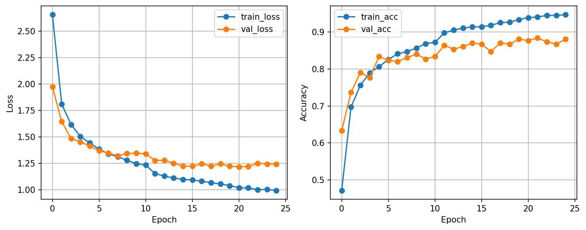

# HW1-Visual-Recognition-Using-Deep-Learning

## Introduction

This project is part of the *Visual Recognition using Deep Learning* course (Spring 2026).
The objective is to solve an image classification problem by assigning each RGB image to one of 100 categories.

The dataset contains:

* 21,024 training/validation images
* 2,344 test images
* 100 classes

The goal is to achieve the highest possible accuracy on the competition leaderboard while respecting the constraints:

* Use **ResNet as backbone**
* No external data allowed
* Model size < 100M parameters

---

## Environment Setup

### Requirements

* Python >= 3.9
* PyTorch
* torchvision
* NumPy
* matplotlib
* tqdm

### Installation

```bash
pip install -r requirements.txt
```

---

## Method Overview

### Data Preprocessing

The input images are preprocessed using the following transformations:

* Resize to 224×224
* RandomResizedCrop
* RandomHorizontalFlip
* ColorJitter
* Normalization using ImageNet statistics

For validation:

* Resize
* Normalize

---

### Model Architecture

The model is based on a **ResNet architecture** (e.g., ResNet18 or ResNet50).

Key modifications:

* Use pretrained weights (ImageNet)
* Replace the final fully connected layer to output 100 classes

---

### Training Strategy

* Loss function: CrossEntropyLoss
* Optimizer: Adam or SGD
* Learning rate scheduler
* Batch training with DataLoader
* Validation at each epoch

Additional improvements:

* Data augmentation
* Model fine-tuning

---

## Usage

### Train the model

```bash
python train.py
```

### Run inference

```bash
python inference.py
```

---

## Performance Snapshot

* Best validation accuracy: 88.7%

* Training / validation curves


---

## Notes

* Only ResNet-based models are used (as required).
* No external datasets are used.
* Several experiments were conducted to improve performance (data augmentation, hyperparameter tuning, etc.).

---

## References

* PyTorch Documentation: https://pytorch.org/
* Torchvision Models: https://pytorch.org/vision/stable/models.html
* Courses Material
